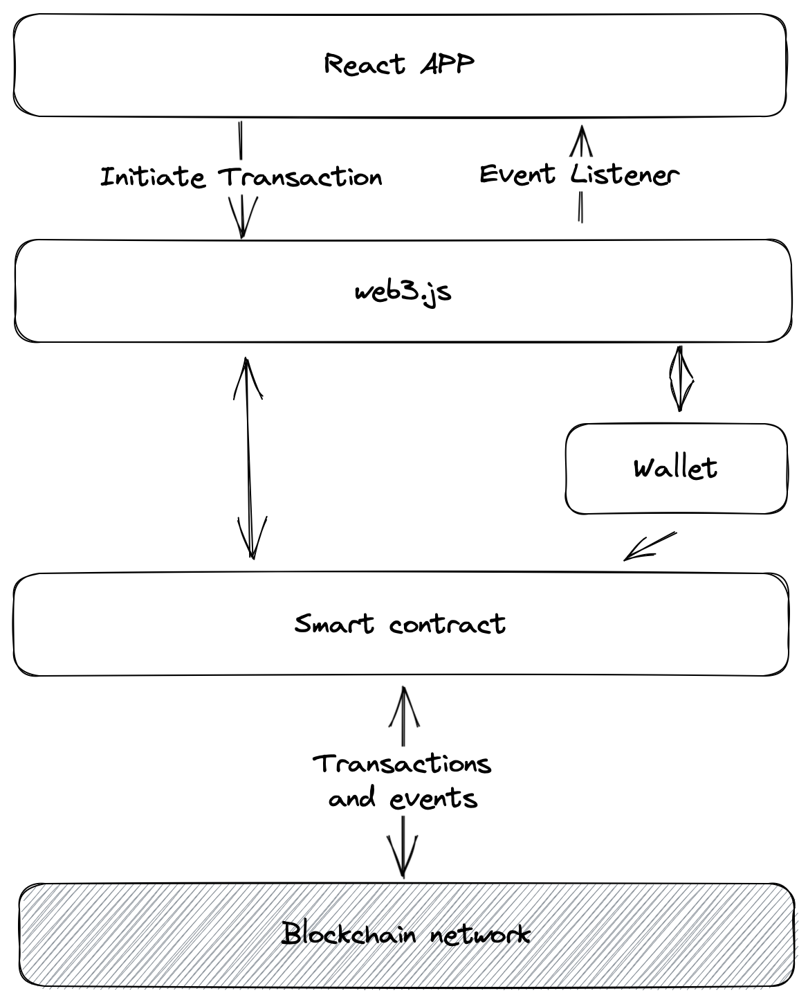

### Requirements
- To build a decentralized name registration system
- Users can register an unregistered name by locking some deposit called "name-fee" proportional to the time for which the name is registered.
- “name-fee” is defined per block and set while deploying the contract
- A user can renew or extend the registration by locking more deposit proportional to name-fee per block
- A user can cancel their registration and should get the remaining deposit back
- Expired names need not be automatically cleared from storage but are transferred to the new owner post-expiry.
- UI should allow the user to register, renew and cancel names, and show the registered names along with the expiry block numbers

### Assumptions
- “name-fee” per block is constant and does not depend on the byte size or type of name
- The time period for each block is constant
- Front-running attacks are not handled

### High Level Architecture

### Data Model
- Name Registry: A mapping of `bytes32` type name to `Name` type which contains the owner's address and the expiry block.
- User: A user is represented by the wallet address.

### Configurations
- Blockchain - ETH Sepolia Testnet
- Refresh interval: 20s
- Contract: [On etherscan](https://sepolia.etherscan.io/address/0xf1a0a207ade7db3f4b93f67099f88eccf6660c6a)

### Improvement Suggestions
- Inclusion of events in the smart contract to allow for better real-time event tracking
- Pagination of name list